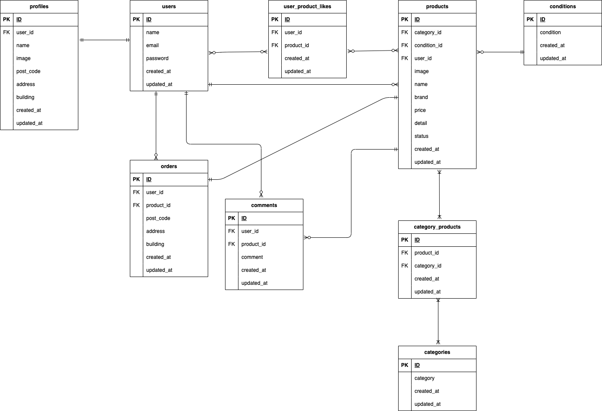

# 模擬案件１　フリマアプリ

## 環境構築

### Docker ビルド

1. リポジトリをクローン  
   `git clone git@github.com:`
2. Docker アプリを立ち上げる
3. Docker ビルド  
   `docker-compose up -d --build`

### Laravel 環境構築

1. PHP コンテナに入る  
   `docker-compose exec php bash`
2. Composer パッケージをインストール  
   `compose install`
3. 環境設定ファイルをコピー  
   `cp .env.example .env`
4. .env ファイルを編集
   `DB_HOST=mysql`  
   `DB_DATABASE=laravel_db`  
   `DB_USERNAME=laravel_user`  
   `DB_PASSWORD=laravel_pass`

5. アプリケーションキーの作成  
   `php artisan key:generate`
6. マイグレーションの実行  
   `php artisan migrate`
7. シーディングの実行  
   `php artisan db:seed`

## ユニットテストとテスト環境構築

1. テスト用.env を作る  
   `cp .env .env.testing`

2. .env.testing を編集  
   ` APP_ENV =test`  
   `APP_KEY =`

   `DB_DATABASE = laravel_test`  
   `UserName = root`  
   `Password = root   `

3. テスト用アプリケーションキーの作成  
   `php artisan key:generate　--env=testing`

4. マイグレーションの実行  
   `php artisan migrate --env=testing`

5. テストの実行は以下のコマンド  
   `php artisan test`
   または  
   `vender/bin/phpunit`

## 使用技術（実行環境）

- PHP8.1
- Laravel8.83.8
- MySQL8.0.26

## ER 図

## URL

- 開発環境：http://localhost/
- phpMyAdmin:：http://localhost:8080/
